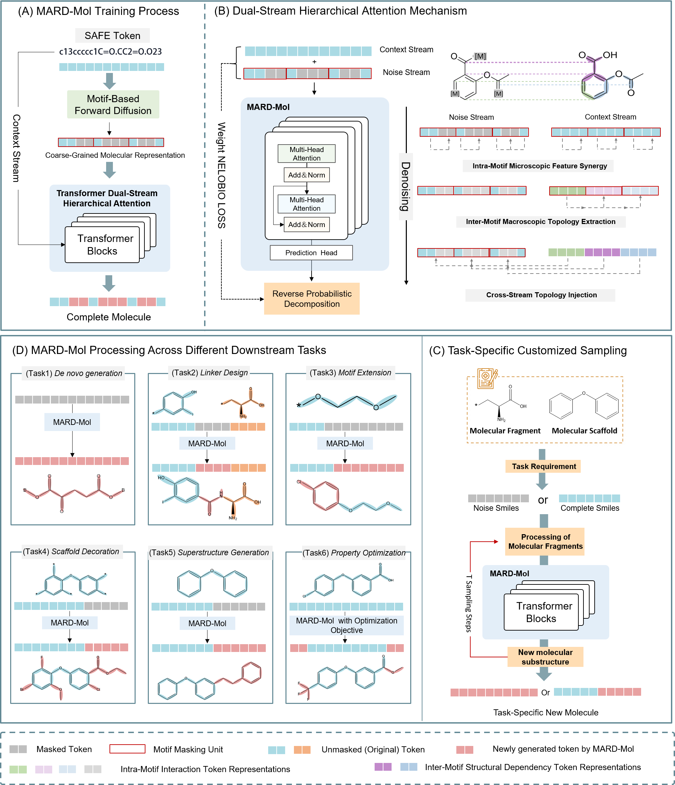

# MARD-Mol: A Hybrid Autoregressive-Diffusion Paradigm for Coarse-Grained Molecular Modeling


This is the official implementation of the paper **"MARD-Mol: A Hybrid Autoregressive-Diffusion Paradigm for Coarse-Grained Molecular Modeling"**. MARD-Mol is a deep generative framework for drug design. It combines autoregressive (AR) global planning with discrete diffusion local generation at the motif level, enabling high-quality molecular generation and a unique "diagnose-and-repair" optimization strategy.

<p align="center">
  
  <br>

</p>


##  Quick Start

### 1. Environment Setup
We provide a comprehensive Conda configuration file to streamline the installation process.

```bash
# 1. Create the environment
conda env create -f environment.yaml

# 2. Activate the environment
conda activate MARD-Mol
```

### 2. Data Preparation (SAFE Dataset)

MARD-Mol utilizes the [SAFE (Sequential Attachment-based Fragment Embedding)](https://huggingface.co/datasets/datamol-io/safe-drugs) dataset for training. 
The code is configured to use the SAFE-GPT dataset.

---

##  Training
All training parameters are located in `configs/train.yaml`. You can modify this file directly to suit your hardware resources.

**Key Parameter:**
* **`unit_size`**: **(Core Parameter)** The unit_size parameter in train.yaml controls the motif length. We recommend keeping the default value 16 for optimal performance.

### Launch Training
Once configured, initiate the training process with the following command:

```bash
python train.py
```

> **Note**: Training logs and checkpoints will be automatically saved to the directory specified by the `hydra` configuration.

---

## Experiments

This framework supports various generative tasks for drug discovery. 

> **Note:** The source code and execution scripts for the experiments listed below will be made fully publicly available upon the acceptance of the manuscript.

### 1. Unconditional Generation (*De Novo*)
Explore the chemical space without any prior constraints.

### 2. Fragment-Constrained Generation
Generate molecules by extending from specific molecular fragments (scaffolds/substructures).

### 3. Property Optimization (PMO)
Property-guided "diagnose-and-repair" optimization.Generate high-scoring molecules targeted at specific properties (e.g., QED, DRD2 activity), including optimization workflows and evaluation metrics.

### 4. Lead Optimization
Fine-tune a starting hit molecule to improve its properties while maintaining structural similarity.

---
